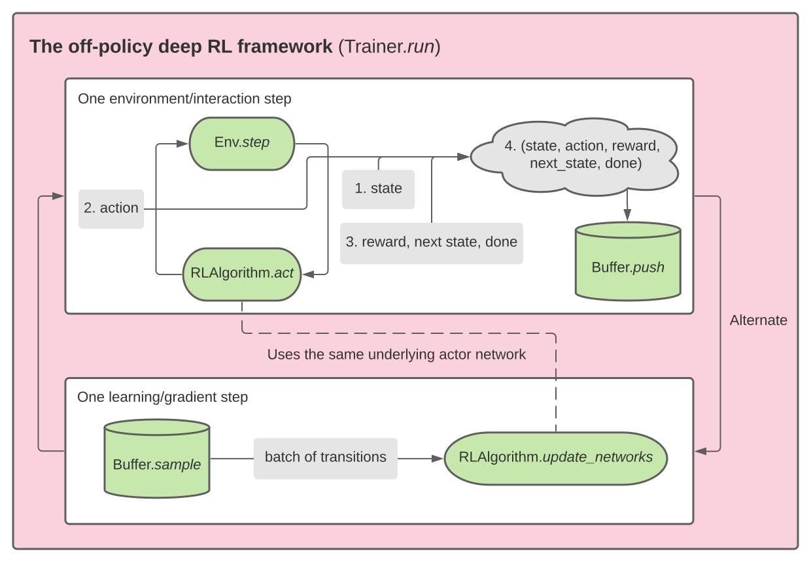

CITE image

PLEASE NOTE THAT THIS REPO IS UNDER ACTIVE CONSTRUCTION.

Table of content

# CleanRL 🧚‍♂️ 

*Minimalistic, well-documented implementation of model-free off-policy deep RL algorithms using PyTorch.*

*This repo implements all algorithms attached to the "Q-learning" node in the diagram below.*

*This project was inpsired by OpenAI Spinning Up, which helped me tremendously along the way.*

  

## Features

<table width="100%" style="margin: 0px;">
<thead>
<tr>
<th align="center">Problems with some repos</th>
<th align="center">Solutions</th>
</tr>
</thead>
<tbody>
<tr>
<td align="center">"Code works but I don't understand the how"</td>
<td align="center">Offers docs and implementation notes</td>
</tr>
<tr>
<td align="center">Uses sophisticated abstraction</td>
<td align="center">Offers graphical explanation of design choices</td>
</tr>
<tr>
<td align="center">Does not have a good requirements file</td>
<td align="center">Has a requirements file tested across multiple machines</td>
</tr>
<tr>
<td align="center">Does not compare against authoritative repos</td>
<td align="center">Compares against OpenAI Spinning Up*</td>
</tr>
<tr>
<td align="center">Does not test on many environments</td>
<td align="center">Tests on many tasks including Atari &amp; Mujoco</td>
</tr>
</tbody>
</table>

\* However, not all algorithms here are implemented in OpenAI Spinning Up.

## Codebase design

The diagrams below are created using Lucidchart.

### Overview

  

### Abstract classes

## Implemented algorithms and notes

Q-learning algorithms:
- Deep Q-learing
- Categorical 51
- <a target="_blank" href="https://nbviewer.jupyter.org/github/zhihanyang2022/CleanRL/blob/main/notes/qrdqn.pdf" type="application/pdf">Quantile-Regression DQN</a>

Policy optimization algorithms:
- TODO

Both:
- TODO

## Gallery of GIFs of learned policies
