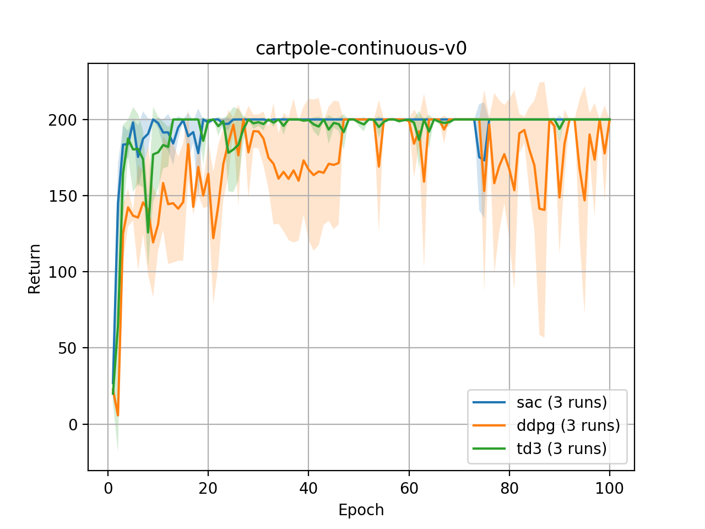
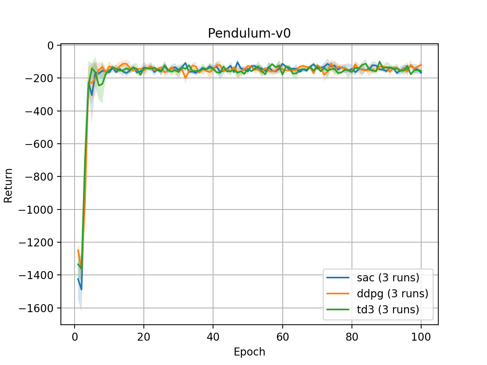
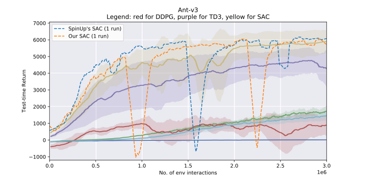

## Introduction

summary:
- introduce what algorithm this repo implements
- what is included in the accompanying technical report
- cite the technical report

## Dependencies

## Structure of the codebase

-   file
    -   containing plots reproducing stable-baselines3; you don’t need to touch this
-   offpcc (the good stuff; you will be using this)
    -   algorithms (where DDPG, TD3 and SAC are implemented)
    -   algorithms_recurrent (where RDPG, RTD3 and RSAC are implemented)
    -   basics (abstract classes, stuff shared by algorithms or algorithms_recurrent, code for training)
    -   basics_sb3 (you don’t need to touch this)
    -   configs (gin configs)
    -   domains (all custom domains are stored within and registered properly)
-   pics_for_readme
    -   random pics; you don’t need to touch this
-   temp
    -   potentially outdated stuff; you don’t need to touch this

## Training code

Add this to your bashrc or bash_profile and source it.

You should replace “pomdpr” with whatever wandb account that you want to use.

```
export OFFPCC_WANDB_ENTITY="pomdpr"
```

From the command line:

```
cd offpcc
CUDA_VISIBLE_DEVICES=3 OFFPCC_WANDB_PROJECT=project123 python launch.py --env <env-name> --algo <algo-name> --config <config-path> --run_id <id>
```

Here's an example of running bumps norm:

```
CUDA_VISIBLE_DEVICES=3 OFFPCC_WANDB_PROJECT=bumps-norm-recurrent python launch.py --env pbc-bumps-normal-pomdp-v0 --algo rsac --config configs/test/template_recurrent.gin --run_id 1
```

Breaking it down:

-   `CUDA_VISIBLE_DEVICES=3`: Running recurrent agents can be computationally expensive for GPU. Therefore, before running anything, do check by `nvidia-smi` that no one is using the GPU you want to run on.
-   `pbc-bumps-normal-pomdp-v0`: I register this env in `domains/__init__.py`. The prefix `pbc` stands for py-bullet-custom, i.e., pybullet envs created by ourselves. These envs have a huge problem. You cannot simultaneously create 2 versions of the env (one for training and one for testing), otherwise 4 bumps would show up in the same playground, which totally destroys the env. Therefore, whenever an env has `pbc` as prefix, we do not do testing and just report training stats.
-   `rsac`: It can be `rdpg` or `rtd3` as well.
-   `configs/config/test/template_recurrent.gin`: You can look into the config to get information about buffer and number of training episodes and etc.
-   `run_id`: This is not a seed. In fact, I avoid using seeds because I would be averaging over multiple seeds anyway. This is only an identifier and will be added to wandb to differentiate between runs. Must be int.

## Evaluation code

After training is done, the policy will be uploaded to wandb, and you can find them here. Simply click download at the very right. Then, within off-policy-continuous-control but outside offpcc, create the following folder structure:

```
results/pbc-bumps-normal-pomdp-v0/rsac/1/
```

and move the downloaded stuff within.

As a sidenode, for recurrent agents, we store the policy as two parts: `actor.pth` (the mlp part) and `actor_summarizer.pth` (the lstm part). Of course, the full policy needs both component to work together.

After you’ve put the trained networks in the right place, simply run the following command, but make sure that you temporarily change the render argument in the init method of robot envs, otherwise nothing will be shown. Along the visualization, some testing stats will be printed (e.g., lengths of trajectories, success)

```
python launch.py --env pbc-bumps-normal-pomdp-v0 --algo rsac --config configs/test/template_recurrent.gin --run_id 1 --render
```


## Pre-trained models


## How to visualize learned policy


## Random notes you don’t need to read

Design of the codebase for rdpg

When it comes to rdpg, there are several things to handle correctly:
- partial episodes vs full episodes (depend on buffer)
- use target network for lstms or not (depend on algorithm)
- burn in or not (depend on both buffer and algorithm)
- store state or not (depend entirely on buffer)

Where "depends on" means "changes need to be made to"

must check isinstance for Recurrent class first

create a configuration guideline
as to be <= than num_steps_per_epoch - update_every for spinup to work

Add the entropy tuning OPTION to spinup, but it can't actually run it at this point
so raise unimplemented error; use SB3 to benchmark that

Cannot run SAC files with spinup yet, since spinup does not support entropy tuning

Both spinup and SB 3 currently only runs on cpu

The othermost env wrapper should always be a timelimit wrapper (mention code reasons)

Requirements: please first install spinup first

Logging to wandb currently only works for pytorch 3 algorithms only in spinup, talk about forked spinup
and where exactly the new code has been added

Have a spinup installation guide and a clone of spinup

Include scripts to run code from spinning up (and hopefully from stable-baselines3 in the future).

Epoch steps should be greater than or equal to the number of timesteps per episode, for logging purposes

Every single environment must be wrapped by TimeLimit, not necessarily the outermost though, explains how my code works

For episodic tasks, you want to set max_episode_len to be 1 + the actual max_episode_len

Best practice is to generate one video for the first run.

To use certain functionalities, you would have to put files in place in certain ways in certain directories

There are muliple ways of tracking stats that happen simultaneously, each with its own purpose.
- csv logging: it might be tricky to download stats from wandb and log locally; so instead this stores
the basic performance stats if you want to plot them yourself with higher quality and more customization

This repo does not take care of plotting results or visualizing policies. Plotting is done directly through wandb.
Visualizing policies require you to first download trained policies and use a different repository. Doing so ensures
that this repo is as clean as possible for training algorithms. New algorithms of the same nature should also be easily
added. 

Add this to your bashrc or bash_profile and source it.

```bash
export OFFPCC_WANDB_PROJECT="offpcc"
export OFFPCC_WANDB_ENTITY="pomdpr"
```

Talk about how to set project and entity

Time remaining may not be always accurate:
- initial random exploration
- some environments as you learn episodes are harder to simulate (verify this)

Interpretation of `progress.csv` headers.

Please note that the environment folders insode results is what YOU would actually
generate by running experiments. The analysis stuff is for my own research; you could
take a look but might not be helpful for you.

Write a guideline on how to design a gin config file

Utilize gradient clipping, which might improve stability (but I haven't investigated this)

## Results

Please change your working directory to `library` first.

### Commands for running and visualizing on classic control tasks

For `cartpole-continuous-v0`:

```bash
python run.py --env cartpole-continuous-v0 --algo ddpg --config configs/classic_control_ddpg.gin --run_id 1 2 3
python run.py --env cartpole-continuous-v0 --algo ddpg --config configs/classic_control_ddpg.gin --run_id 1 2 3 --visualize

python run.py --env cartpole-continuous-v0 --algo td3 --config configs/classic_control_td3.gin --run_id 1 2 3
python run.py --env cartpole-continuous-v0 --algo td3 --config configs/classic_control_td3.gin --run_id 1 2 3 --visualize

python run.py --env cartpole-continuous-v0 --algo sac --config configs/classic_control_sac.gin --run_id 1 2 3
python run.py --env cartpole-continuous-v0 --algo sac --config configs/classic_control_sac.gin --run_id 1 2 3 --visualize
```

<p align="center">
  
</p>

For `Pendulum-v0`:

```bash
python run.py --env Pendulum-v0 --algo ddpg --config configs/classic_control_ddpg.gin --run_id 1 2 3
python run.py --env Pendulum-v0 --algo ddpg --config configs/classic_control_ddpg.gin --run_id 1 2 3 --visualize

python run.py --env Pendulum-v0 --algo td3 --config configs/classic_control_td3.gin --run_id 1 2 3
python run.py --env Pendulum-v0 --algo td3 --config configs/classic_control_td3.gin --run_id 1 2 3 --visualize

python run.py --env Pendulum-v0 --algo sac --config configs/classic_control_sac.gin --run_id 1 2 3
python run.py --env Pendulum-v0 --algo sac --config configs/classic_control_sac.gin --run_id 1 2 3 --visualize
```

<p align="center">
  
</p>

### Results for Mujoco tasks

**What we did**

Mujoco tasks are much much harder than classic control tasks. Therefore, instead of just trusting our implementation, we decided to compare it again the [OpenAI Spinning Up benchmark](https://spinningup.openai.com/en/latest/spinningup/bench.html). Due to time constraints, here we only compared them on two tasks, `Ant-v3` and `HalfCheetah-v3`, using one seed for each. More runs will be added in the future.

**Details you should know** 
- The background of the plots are screenshots from the OpenAI Spinning Up benchmark. 
- The animations shown are only the first few seconds of an entire trajectory.
- Note that both implementations use near-identical hyper-parameters. TODO: explain the only difference
- Approximate running time (on GPU; CPU should be similar since GPU can't really accelerate linear layers):

| Task Name \ Algorithm | DDPG | TD3 | SAC |
| :-------------------: | :--: | :-: | :-: |
| `Ant-v3`              |      |     | 20h |
| `HalfCheetah-v3`      |      |     |     |

**Commands for running stuff**

For this repo:

```bash
python run.py --env Ant-v3 --algo <ddpg or td3 or sac> --config configs/mujoco_<ddpg or td3 or sac>.gin --run_id 1
python run.py --env Ant-v3 --algo <ddpg or td3 or sac> --config configs/mujoco_<ddpg or td3 or sac>.gin --run_id 1 --visualize
```

For OpenAI Spinning Up:

```bash
python -m spinup.run <ddpg or td3 or sac> \
--exp_name ant-sac-pytorch \
--env Ant-v3 \
--epochs 300 \
--steps_per_epoch 10000 \
--start_steps 10000 \
--update_after 9950 \
--update_every 50 \
--max_ep_len 1000 \
--seed 1
```

**Learning curves and animations of trained agents**

Learning curve            |  Animation (our SAC)
:-------------------------:|:-------------------------:
  | 


Talk about how both SAC and TD3 uses a target policy net, which is not present in SAC

Make sure you have mujoco properly installed at whatever directory
If you get this error after installing requirements.txt:

```bash
ValueError: numpy.ndarray size changed, may indicate binary incompatibility. Expected 88 from C header, got 80 from PyObject
```

simply do `pip uninstall numpy` and `pip install numpy`, which sounds silly but works. Thanks to

https://stackoverflow.com/questions/66060487/valueerror-numpy-ndarray-size-changed-may-indicate-binary-incompatibility-exp

I/ use conda, create the env first using conda and then install requirements.txt using pip.

Comment on where working directly should be

CITE image

PLEASE NOTE THAT THIS REPO IS UNDER ACTIVE CONSTRUCTION.

Table of content

# Off-policy methods for continuous control 🧚‍♂️ 

*Clean, modular implementation of model-free off-policy methods for continuous control in PyTorch.*

*This repo implements DDPG, TD3 and SAC and tests them against OpenAI Spinning Up's baselines.*

*OpenAI Spinning Up helped me tremendously along the way.*

<p align="center">
  
</p>

## Features

|              Problems with some repos              |                 Solutions                |
|:--------------------------------------------------:|:--------------------------------------------:|
| "Code works but I don't understand the how"        | Offers docs and implementation notes                 |
| Uses sophisticated abstraction                     | Offers graphical explanation of design choices |
| Does not have a good requirements file             | Has a requirements file tested across multiple machines |
|    Does not compare against authoritative repos    |       Compares against OpenAI Spinning Up*       |
|         Does not test on many environments         |   Tests on many tasks including Atari & Mujoco |

\* However, not all algorithms here are implemented in OpenAI Spinning Up.

## Codebase design

The diagrams below are created using Lucidchart.

TODO:
- The design of the actor and critic class
  - not meant to be used directly, instantiated within the algorithm
  - Randomness should be handled within algorithm, not actor; even for SAC, the mean and std of Gaussian are outputed by actor, then processed in algorithm

### Overview

<p align="center">
  
</p>

### Abstract classes

## Implemented algorithms and notes

Q-learning algorithms:
- Deep Q-learing
- Categorical 51
- <a target="_blank" href="https://nbviewer.jupyter.org/github/zhihanyang2022/CleanRL/blob/main/notes/qrdqn.pdf" type="application/pdf">Quantile-Regression DQN</a>

Policy optimization algorithms:
- TODO

Both:
- TODO

## Gallery of GIFs of learned policies
